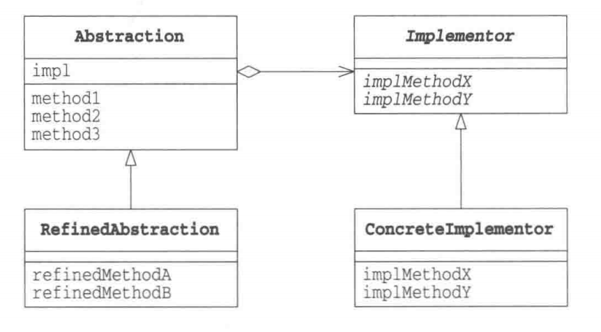

# 桥接模式
----

## 简介

桥接模式的主要目的是将**类的功能层次结构**和**类的实现层次结构**连接起来。

- 类的功能层次结构
  - 父类具有基本功能
  - 子类中加入新的功能
  这种为了增加新的功能，而产生的层次结构叫做**类的功能层次结构**
  
- 类的实现层次结构
  - 父类通过定义抽象方法来定义接口
  - 子类通过实现具体方法来实现接口
  这时产生的层次接口叫做**类的实现层次结构**

当我们编写子类的时候，需要先确定自己的意图，“是增加功能呢？还是增加实现呢？”

如果我们将功能和实现混为一谈，这样会使类变得复杂混乱，所以最好能够将功能层次和实现层次
区分开。

这个时候就用到了桥接模式，将分开的层次结构关联起来。

## 示例

|-| 类名|说明|
|---: | ---: | ---: |
| 类的功能层次结构 | display | 负责‘显示’的类 |
| 类的功能层次结构 | CountDisplay | 增加了‘只显示规定次数’的功能 |
| 类的实现层次结构 | DisplayImpl | 负责‘显示’的类 |
| 类的实现层次结构 | StringDisplayImpl | 使用字符串‘显示’的类 |


示例类图如下：


### **类的功能层次结构：Display类**

```java
/**
 * 类的功能层次结构最顶层
 */
public class Display {
    private DisplayImpl impl;
    public Display(DisplayImpl impl) {
        this.impl = impl;
    }
    public void open() {
        impl.rawOpen();
    }
    public void print() {
        impl.rawPrint();
    }
    public void close() {
        impl.rawClose();
    }
    /**
     * 模版方法 ，不应被重写
     */
    public final void display() {
        open();
        print();
        close();
    }
}
```

**CountDisplay类**

增加了类的功能层次结构，继承Display

```java
/**
 * 类的功能层次结构第二层级，扩展了新的功能
 */
public class CountDisplay extends Display {
    public CountDisplay(DisplayImpl impl) {
        super(impl);
    }
    /**
     * 拓展的新功能（多次打印）
     *
     * @param times
     */
    public void multiDisplay(int times) {
        open();
        for (int i = 0; i < times; i++) {
            print();
        }
        close();
    }
}
```

### 类的实现层次：**DisplayImpl类**

声明了三个抽象方法与Display类中的三个方法相对应。

```java
/**
 * 类的实现层次结构最顶层
 */
public abstract class DisplayImpl {
    public abstract void rawOpen();
    public abstract void rawPrint();
    public abstract void rawClose();
}
```

**StringDisplayImpl类**

类的实现层次结构增加，用于具体实现接口方法。

```java
/**
 * 类的实现层次结构第二层级，具体实现怎么输出
 */
public class StringDisplayImpl extends DisplayImpl {
    private String string; // 要显示的字符串
    private int width; // 要显示的字符串的byte数组长度
    public StringDisplayImpl(String s) {
        this.string = s;
        this.width = s.getBytes().length;
    }
    @Override
    public void rawOpen() {
        printLine();
    }
    @Override
    public void rawPrint() {
        System.out.println("|" + string + "|"); // 前后加入 | 显示
    }
    @Override
    public void rawClose() {
        printLine();
    }
    private void printLine() {
        System.out.print("+");
        for (int i = 0; i < width; i++) {
            System.out.print("-");
        }
        System.out.println("+");
    }
}
```

### 客户端调用

```java
public class Client {
    public static void main(String[] args) {
        Display d1 = new Display(new StringDisplayImpl("hello,1"));
        Display d2 = new CountDisplay(new StringDisplayImpl("hello,2"));
        CountDisplay d3 = new CountDisplay(new StringDisplayImpl("hello,3"));
        d1.display();
        d2.display();
        d3.display();
        d3.multiDisplay(5);
    }
}
```

运行结果

```
+-------+
|hello,1|
+-------+
+-------+
|hello,2|
+-------+
+-------+
|hello,3|
+-------+
+-------+
|hello,3|
|hello,3|
|hello,3|
|hello,3|
|hello,3|
+-------+
```

## 总结

桥接模式类图如下：



桥接模式通过一种弱关联的方式，委托代替继承来将功能和实现一分为二，有利于对功能和实现方法独立的拓展，想增加功能就拓展功能层次，而不必修改实现的方法。
增加的实现功能，也可以被所有实现使用。

## 参考

《图解设计模式》 日:结城浩 著，杨文轩 译