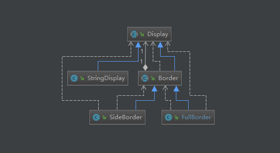
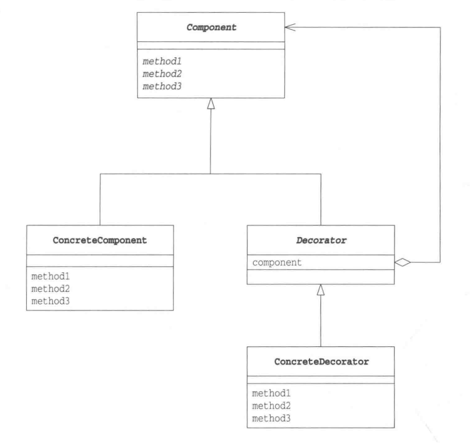

# 装饰模式
----

装饰模式，顾名思义就是向已有的物品上添加装饰物，但是本质仍是原有的物品。
就好比为一幅画添加颜色，添加光影，加上画框等，但本质上被装饰物仍然是一幅画。

## 示例

该示例装饰字符串输出，为字符串输出加上左右边框，和上下边框。

| 类名 | 说明 | 备注 |
| ----: | ----: | ----: |
| Display | 用于显示字符串的抽象类 | 顶层功能抽象 |
| StringDisplay | 用于显示单行字符串的类 | 实现display的功能，此示例中表示被装饰的类 |
| Border | 用于显示装饰的边框的抽象类 | 包含display实例，所有装饰器的父类 |
| SideBorder | 装饰字符串左右边框的类 | 实现Border |
| FullBorder | 装饰字符串周围边框的类 | 实现Border |


示例类图如下：



### 显示字符串的抽象类 Display

可以显示多行字符串的抽象类

```java
public abstract class Display {
    /**
     * 获取横向字符数
     */
    public abstract int getColumns();

    /**
     * 获取纵向行
     */
    public abstract int getRows();

    /**
     * 获取第row行字符串
     */
    public abstract String getRowText(int row);

    public final void show() {
        for (int i = 0; i < getRows(); i++) {
            System.out.println(getRowText(i));
        }
    }
}
```

### 用于显示单行字符串的类 StringDisplay

具体用于显示单行字符串的类，此示例中也作为具体被装饰的对象

```java
public class StringDisplay extends Display {

    private String string;

    public StringDisplay(String string) {
        this.string = string;
    }

    @Override
    public int getColumns() {
        return string.getBytes().length;
    }

    @Override
    public int getRows() {
        return 1;
    }

    @Override
    public String getRowText(int row) {
        if (row == 0)
            return string;
        return null;
    }
}
```

### 主要的装饰抽象类 Border

该类是装饰边框的抽象类，同时也是Display的子类。通过继承装饰物与被装饰物有了相同的方法。
从接口角度而言，装饰物与被装饰物具有一致性。

```java
public abstract class Border extends Display {
    //表示被装饰物
    protected Display display;

    // 在生成实例的时候 通过该方法指定被装饰物
    protected Border(Display display) {
        this.display = display;
    }
}
```

### 具体的装饰类 SideBorder 和 FullBorder

SideBorder为字符串左右加入边框，FullBorder为字符串周围加上边框

```java
public class SideBorder extends Border {
    private char borderChar;
    public SideBorder(Display display, char borderChar) {
        super(display);
        this.borderChar = borderChar;
    }

    @Override
    public int getColumns() {
        return display.getColumns() + 2;
    }

    @Override
    public int getRows() {
        return display.getRows();
    }

    @Override
    public String getRowText(int row) {
        return borderChar + display.getRowText(row) + borderChar;
    }
}

public class FullBorder extends Border {

    public FullBorder(Display display) {
        super(display);
    }

    @Override
    public int getColumns() {
        return display.getColumns() + 2;
    }

    @Override
    public int getRows() {
        return display.getRows() + 2;
    }

    @Override
    public String getRowText(int row) {
        if (row == 0) {
            return "+" + makeLine('-', display.getColumns()) + "+";
        } else if (row == display.getRows() + 1) {
            return "+" + makeLine('-', display.getColumns()) + "+";
        } else {
            return "|" + display.getRowText(row - 1) + "|";
        }
    }

    private String makeLine(char ch, int count) {
        StringBuilder sb = new StringBuilder();
        for (int i = 0; i < count; i++) {
            sb.append(ch);
        }
        return sb.toString();
    }
}
```

### 客户端调用以及结果展示

```java
public class Client {
    public static void main(String[] args) {
        Display d1 = new StringDisplay("hello,world");
        Display d2 = new SideBorder(d1, '#');
        Display d3 = new FullBorder(d1);
        d1.show();
        d2.show();
        d3.show();
        Display d4 = new SideBorder(
                new FullBorder(
                        new FullBorder(
                                new SideBorder(
                                        new FullBorder(new StringDisplay("world!!")
                                        ), '*'
                                )
                        )
                ), '/'
        );
        d4.show();
    }
}
```

输出结果：
```
hello,world
#hello,world#
+-----------+
|hello,world|
+-----------+
/+-------------+/
/|+-----------+|/
/||*+-------+*||/
/||*|world!!|*||/
/||*+-------+*||/
/|+-----------+|/
/+-------------+/
```

## 总结

装饰模式类图：




### 接口的透明性
在该模式中，装饰物与被装饰物具有一致性，即使被装饰物被装饰了起来，接口也不会被掩盖。
其他类仍然可以调用接口来使用，这就是接口的透明性。
装饰模式与组合模式类似，具有递归的结构。装饰物里面的被装饰物实际上也是别的被装饰物的装饰。

### 在不改变被装饰物的前提下增加功能
在该模式下，装饰物与被装饰物具有相同的接口，虽然接口相同，但是越装饰功能就越多。
而且完全不需要被装饰物做任何修改，就可以增加功能。
使用了委托的方式，对被装饰物提出修改的要求被委托到装饰物中去实现。

### 导致增加很多小类
该模式的一个缺点是会导致程序中增加很多功能类似的很小的类

### java.io包与装饰模式
java.io包用到了装饰模式

例如：
使用如下方法读取文件
```java
Reader reader = new FileReader("demo.txt");
```

也可以使用如下方法将文件加入到缓冲区
```java
Reader reader = new BufferReader(new FileReader("demo.txt"));
```

也可以加入行号管理
```java
Reader reader = new LineNumberReader(new BufferReader(new FileReader("demo.txt")));
```

## 参考

《图解设计模式》 日:结城浩 著，杨文轩 译